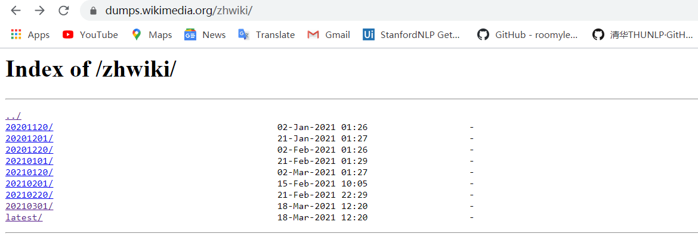
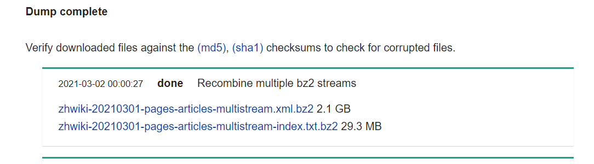

# 中文维基百科词条语料

## 百度百科词条


上图是 [百度百科官网首页](https://baike.baidu.com/)，可以分类查看条目，如 [非遗类](https://baike.baidu.com/feiyi)。百度百科词条数千万计，且更新很快，但不支持批量下载。

## 中文维基百科词条

维基百科每个月会把各种语言的词条网页都打包一次，发布在网站上，比如 [中文维基百科下载地址](https://dumps.wikimedia.org/zhwiki/)。相对于百度百科语料，维基中文词条数较少，大概 百万+。从网站上下载的是压缩的 xml 文件，除掉 xml 标记、markdown 还需要利用 WikiExtractor 和 gensim 的 wikicorpus 库 工具进一步处理。

### 文件下载

有两种下载方式：



* 进入到具体日期目录下（如上图 `20210301/`），会进入一个新的语料文件下载页面



`zhwiki-20210301-pages-articles-multistream.xml.bz2` 是主文件，`zhwiki-20210301-pages-articles-multistream-index.txt.bz2` 是每个词条的 index 信息。

* 进入到 latest 目录下，会看到大量的文件列表，对应着不同的下载地址


可以按需搜索文件名找到对应的下载链接

|         文件名        |     链接地址内容     |
|:--------------------:|:--------------------:|
|zhwiki-latest-pages-articles.xml.bz2   |词条主文件 |
|zhwiki-latest-redirect.sql.gz  |词条重定向（同义词）|
|zhwiki-latest-categorylinks.sql.gz |词条开放分类链接|

此处我们下载词条主文件，和 `zhwiki-latest-all-titles.gz`。

### WikiExtractor 进行文本抽取

从 [Github WikiExtractor](https://github.com/attardi/wikiextractor) 网站下载 WikiExtractor 源码，解压缩后安装，cd 目录后 `python setup.py install` 命令即可。WikiExtractor 完成的是对下载的数据进行抽取处理，得到纯净的文本语料。

用以下命令生成语料文件，`-o` 后为指定的输出目录；`--process` 指定使用的进程数（默认 1）；`--json` 控制生成 json 格式的语料文件（可不用）；`-b` 有时候语料文件太大，可能需要切分成几个小文件，通过此参数控制单个生成文件的大小；最后一个参数控制待处理的原始文件（不用解压缩）。

```
WikiExtractor -o extracted_Wikixml --process 2 -b 200M --json '../zhwiki-20210301-pages-articles-multistream.xml.bz2'
```

文件处理需要一定的时间，结束后会生成一个 `extracted_Wikixml` 文件夹，文件夹 AA 目录下会出现 `wiki_00` ~ `wiki_14` 子文件。此处命令在 Windows 上一直运行不成功，换到 Linux 服务器上就 ok 了。

```
(l) *@**:~/.../wiki$ wikiextractor -o extracted --process 2 -b 200M 'zhwiki-20210301-pages-articles-multistream.xml.bz2'
INFO: Preprocessing 'zhwiki-20210301-pages-articles-multistream.xml.bz2' to collect template definitions: this may take some time.
INFO: Preprocessed 100000 pages
INFO: Preprocessed 200000 pages
.
.
.
INFO: Preprocessed 3500000 pages
INFO: Preprocessed 3600000 pages
INFO: Loaded 973045 templates in 836.5s
INFO: Starting page extraction from zhwiki-20210301-pages-articles-multistream.xml.bz2.
INFO: Using 2 extract processes.
INFO: Extracted 100000 articles (1094.6 art/s)
INFO: Extracted 200000 articles (1863.2 art/s)
INFO: Extracted 300000 articles (1995.5 art/s)
INFO: Extracted 400000 articles (3187.6 art/s)
INFO: Extracted 500000 articles (2417.3 art/s)
INFO: Extracted 600000 articles (2154.1 art/s)
INFO: Extracted 700000 articles (2203.1 art/s)
INFO: Extracted 900000 articles (3036.2 art/s)
INFO: Extracted 1000000 articles (3191.5 art/s)
INFO: Extracted 1100000 articles (3072.7 art/s)
INFO: Extracted 1200000 articles (2993.3 art/s)
INFO: Extracted 1300000 articles (3121.6 art/s)
INFO: Extracted 1400000 articles (3197.9 art/s)
INFO: Extracted 1500000 articles (2298.6 art/s)
INFO: Extracted 1600000 articles (2201.9 art/s)
INFO: Extracted 1700000 articles (2320.5 art/s)
INFO: Extracted 1800000 articles (2315.7 art/s)
INFO: Extracted 1900000 articles (2219.0 art/s)
INFO: Extracted 2000000 articles (2167.5 art/s)
INFO: Extracted 2100000 articles (2420.1 art/s)
INFO: Finished 2-process extraction of 2139568 articles in 954.2s (2242.3 art/s)
```

index 文件格式

```
614:1:Wikipedia:Upload log
614:2:Wikipedia:删除纪录/档案馆/2004年3月
614:13:数学
614:14:Help:目录
614:18:哲学
614:21:文學
614:22:历史
614:25:计算机科学
614:26:Wikipedia:繁简分歧词表
614:31:Wikipedia:宣告/2005年
614:32:Wikipedia:著作权信息
614:35:Wikipedia:方針與指引
614:38:Wikipedia:常见问题解答
614:39:民族
614:40:Wikipedia:专用词汇翻译索引
614:42:Wikipedia:翻譯指引
614:45:戲劇
614:48:电影
614:51:音乐
614:53:经济学
614:56:政治学
614:57:法学
614:59:社会学
614:62:军事学
614:66:信息科学
614:67:物理学
614:70:天文學
614:72:力学
614:74:化學
614:76:地理学
614:78:地质学
614:79:气象学
614:81:生物学
614:83:心理学
614:86:中医学
614:87:海洋学
614:89:水文学
614:94:测绘学
614:100:农业
614:102:Wikipedia:欢迎
614:106:统一资源定位符
614:107:Wikipedia:首页/2004年2月到9月間的版本
614:112:计算
614:114:数据结构
614:115:设计模式
614:118:中华人民共和国
614:119:Wikipedia:错误报告/存档2
614:122:中国计算机科学大事年表
614:125:克利斯登·奈加特
614:126:Self
614:130:Linux内核
```

`wiki_00` 文件格式

```
{"id": "13", "revid": "2383178", "url": "https://zh.wikipedia.org/wiki?curid=13", "title": "\u6570\u5b66", "text": "\u6570\u5b66\uff0c\u662f\u5229\u7528\u7b26\u53f7
```

接下来我们要解决的是简繁体的问题。

### OpenCC

繁体简化使用的工具是 OpenCC，同样到 [OpenCC Github 官网](https://github.com/yichen0831/opencc-python) 下载项目文件安装。

区别文本中是否有繁体字可以用 `print(text.encode('big5hkscs'))`，当有繁体字时候，可以编码为 `big5hkscs`。

此处按照 README.md 的命令行使用，进入到 `opencc-python` 目录下

```
usage: python -m opencc [-h] [-i <file>] [-o <file>] [-c <conversion>]
                        [--in-enc <encoding>] [--out-enc <encoding>]

# index
(l) *@**:~/.../wiki/opencc-python$ python -m opencc -i '/.../wiki/zhwiki-20210301-pages-articles-multistream-index.txt' -c t2s -o index.txt

# all
(l) *@**:~/.../wiki/opencc-python$ python -m opencc -i '/.../wiki/extracted/AA/wiki_00' -c t2s --in-enc 'utf-8' --out-enc 'utf-8' -o wiki_00.txt
```

至此繁简转化结束。

## References

- [x] [opencc-python Github](https://github.com/yichen0831/opencc-python)
- [ ] [mattzheng/ChineseWiki 维基百科中文词条](https://github.com/mattzheng/ChineseWiki/blob/master/README.md)
- [x] [中文维基百科下载地址](https://dumps.wikimedia.org/zhwiki/)
- [ ] [stanfordnlp/GloVe 官网](https://github.com/stanfordnlp/GloVe)
- [x] [zlsdu/Word-Embedding](https://github.com/zlsdu/Word-Embedding)

